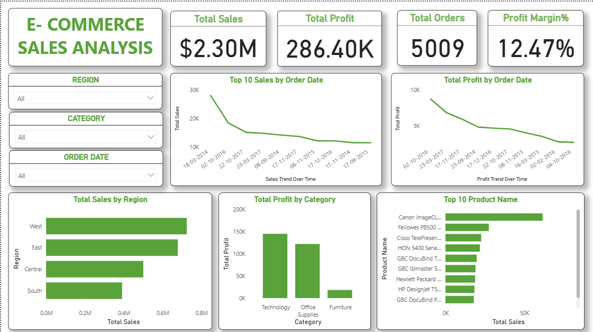

# Superstore Sales Dashboard

## Overview
Built an interactive Power BI dashboard to analyze retail sales performance.

## Tools Used
- Power BI
- DAX
- Excel

## KPIs
- Total Sales
- Total Profit
- Total Orders
- Profit Margin %

## Key Insights
- Technology category generated the highest profit.
- West region contributed the most revenue.
- Sales showed seasonal trends across months.

## Dashboard Screenshot
(Add screenshot here)

## Dashboard Preview

