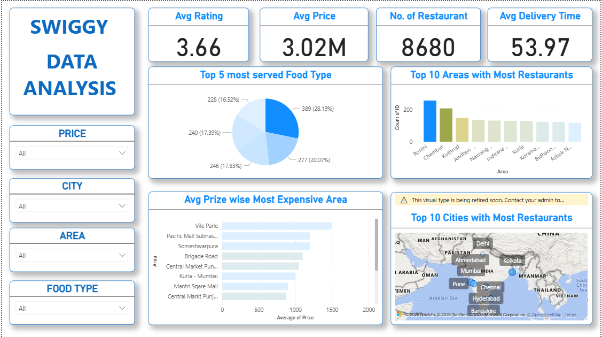

# Swiggy Restaurant Analysis

## Overview

Performed exploratory data analysis on Swiggy restaurant data using Python to identify trends in restaurant ratings, costs, online ordering, and customer preferences.

## Tools Used

* Python
* Pandas
* NumPy
* Matplotlib
* Seaborn
* Jupyter Notebook

## Analysis Performed

* Data Cleaning and Preprocessing
* Average Restaurant Rating Analysis
* Cost Distribution Analysis
* Online Order Availability Analysis
* Book Table Availability Analysis
* Most Popular Restaurant Categories
* Restaurant Votes Analysis

## Key Insights

* Most restaurants have ratings between 3.5 and 4.5.
* Online ordering is available for the majority of restaurants.
* A small percentage of restaurants offer table booking.
* Mid-range restaurants dominate the dataset.
* Highly rated restaurants generally receive more customer votes.

## Files Included

* swiggy_analysis.ipynb
* dataset.csv
* screenshot.png

## Dashboard / Visualization Preview

